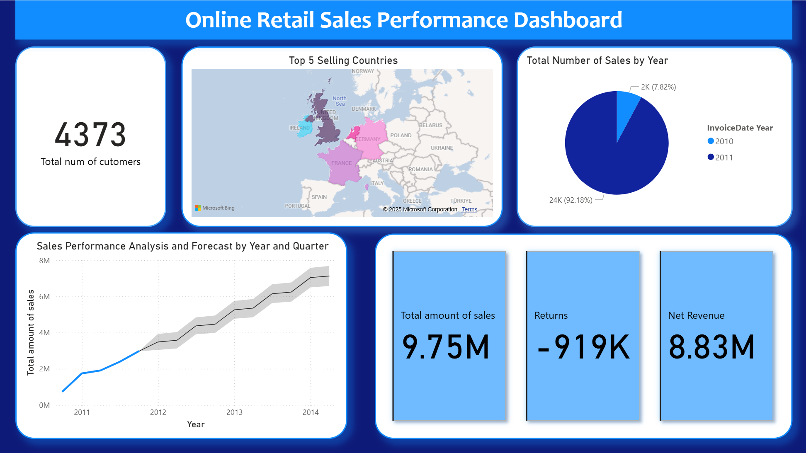

# 🛒 **Online Retail Sales Performance Dashboard**

This project showcases my skills in **data analysis**, **business intelligence**, and **data visualization** using **Power BI**. The goal was to transform and analyze a dataset of online retail transactions to create a dynamic dashboard that reveals deep insights into sales performance.

---

## 🔍 **Project Overview**

This dashboard was built using the **Online Retail** dataset, a popular public dataset from the UCI Machine Learning Repository covering UK-based online retail transactions. Key project steps included:

- 📥 **Data Acquisition:** Sourcing raw transactional data from CSV files.
- 🧹 **Data Transformation:** Cleaning and shaping data with Power Query Editor.
- 🗂️ **Data Modeling:** Creating a logical, efficient data model in Power BI.
- 🧮 **DAX Calculations:** Writing custom measures to compute key performance indicators (KPIs).
- 📈 **Data Visualization:** Designing an interactive dashboard to communicate insights effectively.

**🔗 Dataset:** [Online Retail Dataset](https://archive.ics.uci.edu/dataset/352/online+retail)

---

## 🎯 **Dashboard Highlights**

- 👥 **Total Customers:** Unique customer count.
- 🧾 **Total Sales:** Number of distinct transactions.
- 💰 **Total Amount of Sales:** Gross revenue generated.
- ↩️ **Returns:** Total value of returned items.
- 📊 **Net Revenue:** Sales minus returns.
- 🌍 **Geographic Analysis:** Map highlighting top 5 performing countries.
- 📅 **Sales Trend:** Line chart showing sales over time with forecasting.
- 🕒 **Sales by Year:** Doughnut chart representing sales distribution by year.

---

## 🛠️ **Technical Skills Demonstrated**

- 🧹 **Data Cleaning & Transformation:**

  - Adjusted data types (dates, numbers)
  - Handled missing and null values
  - Created custom calculated columns like **Total Amount** (`Quantity` × `UnitPrice`)

- 📊 **DAX (Data Analysis Expressions):**

  - `DISTINCTCOUNT` for unique customers and sales
  - `SUM` for total sales amount
  - `CALCULATE` + `FILTER` for summing returns (negative sales)

- 🎨 **Data Visualization & Storytelling:**

  - Chose appropriate visuals: KPI cards, maps, line charts, and doughnut charts
  - Built interactive reports with slicers and filters

- 💼 **Business Acumen:**
  - Developed meaningful KPIs to assess business performance and opportunities

---

## 🚀 **Future Enhancements**

- 🕰️ Adding a time dimension table for advanced date-based analysis
- 👥 Customer segmentation to identify high-value segments
- 🔎 Drill-through pages to explore granular transaction details

---
